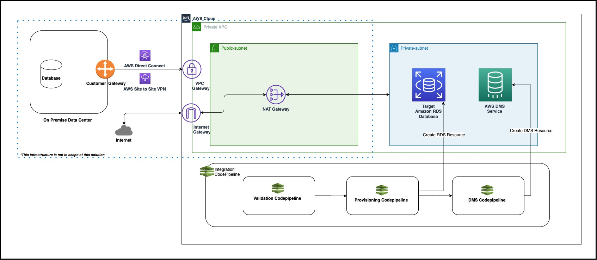
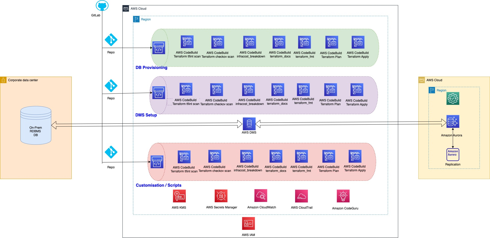

## Database Migration DevOps Framework using Terraform samples

## Table of content
 * [Overview](#overview)
 * [Prerequisites](#prerequisites)
 * [Architecture](#architecture)
 * [Deployment](#deployment)
 * [Use Case](#use-case)
 * [Cost Estimation](#cost-estimation)
 * [Benefits](#benefits)
 * [Limitations](#limitations)

## Overview
Database Migration framework enable customers to accelerate their database migration journey from on-prem to AWS cloud and provides automation by enforcing DevOps practices (like CI/CD Pipeline). It also provides best practices around the services used in the database migration process like Database Migration Service(DMS), Secret Management, Database Provisioning using Infrastructure as code (IaC), CI/CD automation using AMS CodeSuite. This Database Migration Deployment Framework (DMDF) provides customers an automated deployment solution to provision and migrate databases onto AWS. It replaces manual efforts and redundancy with true automation to accelerate customers cloud adoption and database migration journey using AWS database and migration services.

## Prerequisites 
- [Active AWS Account](https://aws.amazon.com/premiumsupport/knowledge-center/create-and-activate-aws-account/) 
- [Least privilege IAM policy](https://aws.amazon.com/blogs/security/techniques-for-writing-least-privilege-iam-policies/)
- [Terraform](https://developer.hashicorp.com/terraform/tutorials/aws-get-started/install-cli)
- [Terraform state management using S3](https://developer.hashicorp.com/terraform/language/settings/backends/s3)

## Architecture
This architecture provides the complete infrastructure overview for database migration process. As per this solution: 
- Source database - It is a SQL database present on premise,virtual machine or any other cloud provider.
- On premise and AWS Connectivity - Create a VPN or Direct Connect connection between on-premise database and AWS.It will provide secure communication between source database and the AWS infrastructure.
- Target database - This is AWS RDS database which is hosted inside the AWS VPC with the help of database provisioning pipeline.
- AWS DMS - The DMS (Database Migration Service) provided by AWS can help you with replicating your on-premise database to an AWS VPC. It will be used to configure the replication of source database to the target database.

Below architecture explains the infra set up with different levels of the database migration process which involves the steps of provisioning, DMS set up and validation.
- Validation pipeline: This pipeline performs all the pre-requisite validation to ensure that all checks are passed.The integrated pipeline will move to the next step once all necessary validations have been completed.
- DB provisioning pipeline constist of various codebuild stages which will perform Terraform actions on the provided Terraform code for database. Once all checks are completed it will deploy resources in target AWS Account.
- DMS Pipeline - Consists of various Codebuild stages, which will perform certain tests and then provision the DMS infrastructure required for performing the migration using IaC.

## Deployment
To migrate the database first need to update the ssm parameter. Here each module (db-validation,db-provisioning,db-dms) will have iac template i.e. CI/CD of the module and terraform code which can be modified as per customer specific requirements. [db-cicd-intergration](./db-cicd-intergration) pipeline can be used for complete db migration which includes all steps as needed for provisioning,validation and dms.

1. [setup](./setup/db-ssm-params): All parameter values with customized values can be configured in one place using this set up. This is being used to store all customized required SSM parameters. These parameters need to be set before running CI/CD pipeline.
  
2. [db-validation](./db-validation): This module performs below validation checks on source database and its connectivity, target infrasturcture hosted on-premise or cloud using AWS CI/CD services like CodeCommit, CodePipeline and CodeBuild:
    * Target AWS Account configuration
    * Source database
    * Target Infrastructure
    * Target database configuration
    * Network connectivity

3. [db-provisioning](./db-provisioning): Two directories are included in this module, one for Terraform code and the other for the Provisioning pipeline, which allows us to provision the target database.

4. [db-dms](./db-dms): This module consist of db-dms-iac-templates and db-dms-code. This helps to provision the DMS using Infrastructure as code (IaC).

5. [db-cicd-integration](./db-cicd-integration):This is the centralized pipeline to migrate the database from source to target using the below child pipelines in given sequential order.
    * db-validation-pipeline
    * db-provisioning-pipeline
    * db-dms-pipeline

6. [terraform-modules](./terraform-modules): There are several terraform modules in this directory that will be used during the database migration process. These include codebuild, codecommit, codepipeline, iam-role, KMS, and S3.There will be a main.tf file for each section and a list of variables that could be customized according to the requirements.

## Use-case
This framework demonstrates homegeneous database migration use case. Database which is running on VM, container or on premise will be migrated to RDS. Once the application which are using the migrated database is tested and all test cases are passed we can shutdown the old database.

## Cost-Estimation
As the used services are not free, there are some charges associated with this framework. You can calculate the cost by [AWS Pricing Calculator](https://calculator.aws/#/).

## Benefits
This solution may help :
* To standardise the database Infrastructure as Code (IaC) templates and automation scripts.
* To innovate faster by automating end to end solution for database migration.
* To enforce DevOps practices in database operations. 
* To increase agility, on-demand scalability and easy geographic expansion.
* To minimize manual interventions in database provision and migration operations.
* To increase revenue by enhancing the product by adding automation, review and monitoring features with DevOps practices without upfront costs.

## Limitations
* This aws sample supports homogeneous migration only.

## Contributors
- Aarti Rajput
- Aniket Dekate
- Ashish Bhatt
- Nadeem Rehman
- Naveen Suthar
- Dr. Rahul Gaikwad
- Ruchika Modi
- Tamilselvan P
